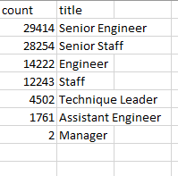
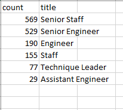

# Pewlett-Hackard-Analysis

## Overview
The purpose of this analysis is to identify the number of retirieng employees per title and identify those who are eligible to participate in a mentorship program

## Deliverable 1: The Number of Retiring Employees by Title

Above is a summary table of the total number of employees that are eligable for retirement soon,
 * The senior level titles have the most people retiremeing followed by engineer and staff 
 * There are only 2 managers that are will be retiring soon
 
## Deliverable 2: The Employees Eligible for the Mentorship Program

There are 1550 individuals that are eligible for the mentorship program, above is a summary of their current titles
  * There are currently no managers eligible for a mentor
  * There are plenty of mentors available for all of the other roles

## Summary 
According to the analysis above there are plenty of qualified, retirement-ready employees in departments to mentor the next generation of employees however there are a lot of roles that need to be filled. 
If all retirment-ready employees actually retired you would need to fill 90,398 roles.
When you break this down by job title 22-49% of all employees in each job title would retire.
I would suggest increasing the mentorship elgibile population so that if all those people do retire their knowledge would not be lost.
